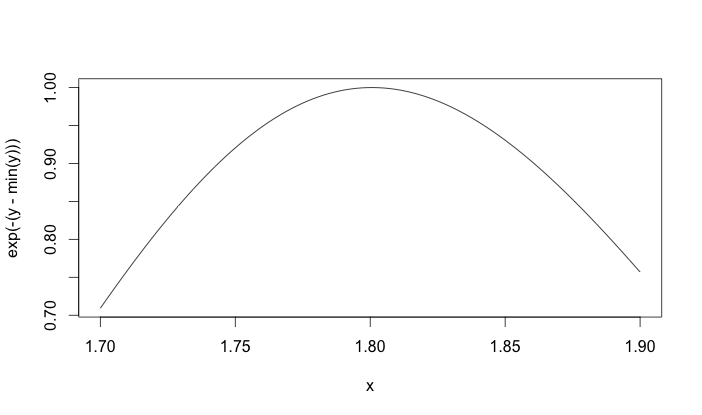

Scoping Rules
=============

Application: Optimization
-------------------------

Why is any of this information useful?

* Optimization routines in R like optim(), nlm(), and optimize() require you to pass a function whose argument is a vector of parameters (e.g. a log-likelihood)
* However, an object function might depend on a host of other things besides its parameters (like data)
* When writing software which does optimization, it may be desirable to allow the user to hold certain parameters fixed

Maximizing a Normal Likelihood
------------------------------

Write a "constructor" function.

	make.NegLogLik <- function(data, fixed = c(FALSE, FALSE)) {
		params <- fixed
		function( p ) {
			params[!fixed] <- p
			mu <- params[1]
			sigma <- params[2]
			a <- -0.5 * length(data) * log(2 * pi * sigma^2)
			b <- -0.5 * sum((data-mu)^2) / (sigma^2)
			-(a + b)
		}
	}

Note: Optimization functions in R minimize functions, so you need to use the negative log likelihood.

	> set.seed(1); normals <- rnorm(100, 1, 2)
	> nLL <- make.NegLogLik(normals)
	> nLL
	function( p ) {
			params[!fixed] <- p
			mu <- params[1]
			sigma <- params[2]
			a <- -0.5 * length(data) * log(2 * pi * sigma^2)
			b <- -0.5 * sum((data-mu)^2) / (sigma^2)
			-(a + b)	
	}
	<environment:0x165b1a4>
	> ls(environment(nLL))
	[1] "data" "fixed" "params"

Estimating
----------

	> optim(c(mu = 0, sigma = 1), nLL)$par
	      mu    sigma
	1.218239 1.787343

Fixing sigma = 2

	> nLL <- make.NegLogLik(normals, c(FALSE, 2))
	> optimize(nLL, c(-1, 3))$minimum
	[1] 1.217775

Fixing mu = 1

	> nLL <- make.NegLogLik(normals, c(1, FALSE))
	> optimize(nLL, c(1e-6, 10))$minimum
	[1] 1.800596

Plotting the Likelihood
-----------------------

	nLL <- make.NegLogLik(normals, c(1, FALSE))
	x <- seq(1.7, 1.9, len = 100)
	y <- sapply(x, nLL)

	plot(x, exp(-(y - min(y))), type = "1")

Summary
-------

* Objective functions can be "built" that contain all of the necessary data for evaluating the function
* No need to carry around long argument lists&mdash;useful for interactive and exploratory work
* Code can be simplified and cleaned up
* Reference: Robert Gentleman and Ross Ihaka (2000). "Lexical Scope and Statistical Computing," JCGS, 9 491-508